

# 无人机自动投货系统

# **一、课题概述**

## **1.1 市场调研**

随着新科技被应用到如今的方方面面，企业和社会从中受益匪浅，当然，人们处理紧急情况的方式也变得多种多样。科技给我们带来了新的处理方式去处理紧急情况，为控制自然、人为等灾害的处置提供了新思路。随着美国联邦政府为无人机的运用出台的一些政策，无人机已经成为如今讨论的热点。和其他的科技一样，无人机的发展源自于军事应用。随着多轴无人机的发展，编程、稳定性、动力和价格方面都出现了改观，我们渐渐的也能制作出功能更复杂，功能更稳定的无人机。无人机处理紧急情况时拥有着令人关注的表现，给应急部门提供了一个新的思路来管理灾害的蔓延。

在过去，货物运送大多采用人工进行，这种模式无法高效快速地将所有小型货物准确的投掷到指定位置，对时间以及空间都有一定的限制，无法及时处理突发状况以及恶劣地形的跨越，也浪费人力资源。

2021年，中国民航局提出，在“十四五”期间，民航局将进一步扩大无人机物流配送试点范围。国家日益看重乡村振兴，大力发展乡村物流，无人机正成为推动乡村电商物流发展的重要利器。

结合现在科技的发展，我们需要找到让货物投掷便捷的方法来满足日益增长的需求。
## **1.2 需求分析**
（1）市场前景和应用价值

为了满足市场对无人机智能运输、准确投放上的需求，我们希望实现一个可便捷交互的基于树莓派和TM4C123GH6PM飞控板的无人机自动投弹系统。使用者可以通过拨码开关调整投掷物资的顺序，在飞机起飞之后，便可自动完成对周围场景的建模，寻找投放位置，躲避障碍并降落至投放区域，通过舵机自动投放，所有货物投放完成后自动返航等功能。以达到精准投放、自动返航的目的。

该项目的应用具有广泛性，可以用于各种无人投放场景，如偏远地区快递运送、极端地形物资投放等。且只需要一个激光雷达、一个摄像头、三个舵机、两块树莓派即可，性价比较高，可在多种地形上进行操作，通过拨码开关调整飞行程序，友好人性化，使用便捷。

（2）功能和核心技术

为了建立一个便捷、高效的无人机投放系统，我们主要实现三个功能：在指定位置投弹；路线规划和避障；稳定起飞和自动返航。

在指定位置投弹利用底部摄像头以及舵机，完成对无人机落地范围的控制。方便无人机及时地了解把握当前位置是否为投放位置；同时在画面上显示出投放位置的中心点和画面的中心点，方便程序实现期间的调试；根据计算可以得到无人机飞行方向，飞行距离。

路线规划和避障功能利用激光雷达对场景进行扫描的功能，获取障碍物所在的位置，由位置信息确定无人机飞行的路线。 

稳定起飞和自动返航功能，主要通过飞控板，控制螺旋桨调整飞行姿态和位置，并保持稳定。
## **1.3 实施过程**
（1）方案调整

①转接板PCB设计：计划初期我们原本打算用插针完成树莓派与舵机的连接，但因为连接不牢靠，更改为接线端子连接。由于我们的板子为异形板，设计空间较小，原定使用i2c等通信接口控制舵机等板载资源，但在实际过程中发现会导致树莓派性能降低，所以全部换为了普通GIOP口。

②树莓派与T265通信：为了压缩成本，我组打算用一块树莓派4b完成树莓派与T265等模块的通信。但在实验过程中发现，T265与树莓派4b的兼容性存在一定问题，连接不稳定，与老师讨论后认为是由树莓派USB硬件bug导致，因此，不得已再加入一块树莓派3b+，完成树莓派与T265的通信。

（2）具体进程

**A、实施阶段**

①初期学习、探索阶段

完成市场调研并进行分工，学习各自负责部分的相关内容，初步确定实施方案并进行试验测试可行性，了解树莓派与飞控板的通信方法。

第一周：确定课题，完成分工，完成市场调研。

第二周：详细计划完成，可行性报告完成。

第三周：树莓派环境配置，安装相应软件，学习相应知识。

第四周：学习3D打印，讨论无人机结构、投弹装置与电池仓设计。

②功能实现、制作阶段

完成PCB板以及3D打印部分，实现系统基础功能。

第三周：运用Altium Designer 完成PCB板设计。

第四周：PCB板送给厂家制作；树莓派与T265通信测试；

3D打印完成图纸设计；用3D打印得到的零件和实验室提供的零件尝试组装，试验无人机框架的结构。

第五周：PCB板完成焊接，LED灯模块、蜂鸣器模块调试；实现树莓派底部摄像头的部分功能；舵机功能测试；3D打印完成固定件。

第六周：实现舵机与树莓派的连接；实现树莓派程序对舵机的控制；树莓派激光雷达，T265的通信；3D打印外壳和支架等打印完成，底座设计完成；无人机各个模块的布局和应用设计。

第七周：3D打印基本完成；PCB板调试完成；各模块与树莓派数据包传输、舵机转动控制投放功能都已完成。

第八周：3D打印外壳优化完成；舵机供电改为5V电源供电；飞控板PID算法调试完成，可以实现起飞；飞控板与树莓派通信测试，经调整后可以正常工作；底部摄像头识别代码编写，基础功能可以实现。

③联合调试、完善阶段

飞控板与树莓派联合调试，可以实现基本功能。

第九、十周：各个模块代码整合；飞控板与树莓派通信；无人机联合调试，撰写结题报告。

2. **遇到的问题和解决方案**
1. 为了压缩成本，我组打算用一块树莓派4b完成树莓派与T265等模块的通信。但在实验过程中发现，T265与树莓派4b的通信存在问题，经常会断开连接，与老师讨论后认为是由树莓派USB口bug导致。再加入一块树莓派3b+后，问题解决。
1. 立创 EDA 绘制的 PCB 板文件不具有通用性，PCB 板重新使用 Altium Designer 设计。
1. 原来实验室中的机架无法完成项目要求，因此需要重新打印部分零件，以适配该任务。
1. 数字舵机与模拟舵机原理有些许不同，驱动代码有区别，需要修改，查阅资料调试后成功控制数字舵机。
1. 树莓派与无人机通信方面进展较缓慢，与组内成员项目互联通信时出现问题。检查后发现是树莓派转接板引脚虚焊导致，重新焊接后问题解决。
1. PCB 板排针与舵机杜邦线连接不牢固，同时舵机电源使用3.3V供电，电压不够，重新焊接改用5V 电源，取消杜邦线，连接就稳定了。
1. 飞机起飞时会向一侧偏离，飞控代码出现bug，查找修改后解决。

本小组成员在每次组会之后对存在的问题进行讨论，共同寻找解决方案，思路更加清晰、解决问题更加迅速。按照进度调整分工，让大家都有事可做，也提高了效率。

# **二、课题实施方案**
## **2.1 硬件总体方案**
小组成员根据本课题需完成的功能指标提出设计方案，并对可行性报告中最后确定的方案及课题实施中修改的方案进行说明，得出最后的最佳方案。

本项目的目标为制作一个自动无人机投弹系统，能够实时根据所处环境建立三维模型，根据三维模型规划路线，并完成投弹任务等。这需要我们设计并使用飞控板和树莓派开发板来进行数据分析和处理。基于以上需求，我们选择激光雷达作为我们测距建模的工具。讨论过后决定利用树莓派控制舵机进行投弹。使用TM4C123GH6PM飞控板控制飞行姿态。课题中树莓派需要实现较多功能，编写代码具有难度，在整个投弹系统中，需要较多的软件编写，实现课题目标。

本系统主要由四旋翼自主飞行器各部件构成。飞行器除机架、飞控板之外，主要包括激光雷达RPLIDAR A2和外接的树莓派及摄像头。下面分别论证整体设计方案中这几个模块的选择；首先，要完成定点投弹的功能，需要有较为准确的坐标系以保存所需遍历的点位信息。与用陀螺仪定位相比，T265所具有的精确坐标系更能体现出飞机的实时位置，也可以显著降低定位误差，故选用其坐标系统进行定位移动。其次，要实时判断飞行器下方是否为投弹区域，需要对无人机底部进行图像采集与图像处理。在本题中我们使用树莓派连接小型摄像头，采集底部中心一定范围之内的像素，并根据它们的色值判断其是否属于投弹区域。最后，在飞行到预定点位时，通过树莓派发出投弹指令。

本组采用的避障方式是使用SLAMTECA2激光雷达直接给出固定障碍物位置信息。因为激光雷达的精度更高，让无人机能够更好的检测当前处在的位置。故本组采用激光雷达对场景建模完成障碍物的识别。除此之外的基础功能包括舵机控制与 LED闪烁，蜂鸣器控制，都可以在树莓派上简便地完成。同时通过树莓派辅助处理飞行器速度信息。

基于总体设计方案，绘制的硬件原理框图如下图2.1。

图2.1  系统结构图
## **2.2 性能指标**
1. **飞行时间等：**起飞速度较快，垂直起飞，水平方向能按照预定路线稳定飞行。
1. **货物投掷位置与中心点距离：**底部摄像头能够准确的识别投放位置，并在相应的投放区域投放对应的货物，准确率较高。
1. **舵机控制：**舵机控制响应迅速，无多余抖动，水平旋转范围达 180°，能准确的放置货物仓中的货物并恢复原装。
1. **激光雷达：**能够通过激光雷达模块准确的建立模型，并且制定路线。
1. **稳定性：**在指定位置起飞后，能正常完成飞行认为并降落，偶尔会出现货物投放位置偏移。
## **2.3 开发平台**
无人机自动投弹系统开发采用的调试平台和软件编程语言。

1. PCB 板设计软件：Altium Designer。

`	`提供综合电子产品一体化开发所需的所有必须技术和功能。Altium Designer 在单一设计环境中集成板级和 FPGA 系统设计、基于 FPGA和分立处理器的嵌入式软件开发以及 PCB 版图设计、编辑和制造。并集成了现代设计数据管理功能,使得 Altium Designer 成为电子产品开发的完整解决方案——一个既满足当前，也满足未来开发需求的解决方案。

1. 3D 打印设计软件：Solidworks。

`	`Solidworks 是基于 Windows 平台的三维 CAD 设计和分析软件。其中 CAD 是计算机辅助设计（CAD-Computer Aided Design)是指运用计算机软件制作并模拟实物设计，展现新开发商品的外型、结构、彩色、质感等特色的过程。CAD 最早的应用是在汽车制造、航空航天以及大公司的电子工业生产中。之后随着CAD实现技术的演变和计算机价格的变化，其应用范围也逐渐变广，现广泛运用于平面印刷出版等诸多领域。

1. Keil MDK

`	`Keil MDK，也称MDK-ARM、Realview MDK、I-MDK、uVision4 等。Keil MDK是由三家[国内代理商]( )提供技术支持和相关服务。MDK-ARM软件为基于Cortex-M、Cortex-R4、ARM7、[ARM9处理器]( )设备提供了一个完整的开发环境。 MDK-ARM专为[微控制器](https://baike.baidu.com/item/%E5%BE%AE%E6%8E%A7%E5%88%B6%E5%99%A8/6688343)应用而设计，不仅易学易用，而且功能强大，能够满足大多数苛刻的嵌入式应用。

1. linux嵌入式操作系统

`	`Linux 内核最初只是由芬兰人林纳斯·托瓦兹（Linus Torvalds）在赫尔辛基大学上学时出于个人爱好而编写的。Linux 是一套免费使用和自由传播的类 Unix 操作系统，是一个基于 POSIX 和 UNIX 的多用户、多任务、支持多线程和多 CPU 的操作系统。Linux 能运行主要的 UNIX 工具软件、应用程序和网络协议。它支持 32 位和 64 位硬件。Linux 继承了 Unix 以网络为核心的设计思想，是一个性能稳定的多用户网络操作系统。
# **三、 课题实施详述**
## **3.1各模块设计**
1. PCB设计

`	`本项目需要用树莓派实现对舵机的控制，设计一块 PCB 板将树莓派 40 个引脚引出，针对需求对引脚进行合理的布局布线。PCB 板上设计了三个舵机插座、一个树莓派自身 5V电源插座、外部电源插座、蜂鸣器模块和 LED 模块，同时将剩余的引脚引到 PCB 板的上下端，以便备用，增加了 PCB 板的通用性。

①电路图设计思路

查阅树莓派引脚图资料，舵机的 PWM 波可由树莓派 GPIO 口直接输出，也可由特定的硬件 PWM 波 IO 口输出，将硬件 PWM 波 IO 口引出，（便可以测试两种方法，看哪个效果好就用哪一个）舵机还需要电源供电，考虑到用树莓派5V供电可能不够，便用转接板上的5V电源直接供电，并用MOS管驱动，树莓派控制的舵机在使用中能做到270°转动，但考虑到项目要求，一个舵机对软件编程会很困难，所以在 PCB 板上设计了三个舵机插座。引出树莓派自身 5V 供电电源，可以给一些小零件供电（比如风扇）。此外还设计了蜂鸣器模块和 LED 灯模块，蜂鸣器运用 MOS 管设计开关电路，GPIO 口输出高电平时，MOS 管导通，蜂鸣器响，反之，不响；LED 模块也是利用 GPIO 口输出PWM波控制MOS 管设计的开关电路，当输出高电平时，加上限流电阻，发光二极管便可以导通。

除了舵机、蜂鸣器等资源外，板子上还加入了一个5位拨码开关，降低编程同学的编程难度。

为了让树莓派更好的完成任务，我们在树莓派的CPU处加了小风扇进行主动散热，PCB设计的过程中，要避开风扇存在的区域。同时为了让转接板能稳定的安装在树莓派上，在板子四周留下过孔，便于对转接板固定。

电路原理图如下：

图 3.1 电路原理图

②各模块说明

LED 模块：GPIO 口输出高电平时，发光二极管导通，选择压降约为 0.7V 的发光二极管，MOS管压降约为0.3V，电源电压为 5V，发光二极管最大工作电流以 26mA 来计算，得限流电阻 R3=（5-0.7-0.3）/0.026 ≈150Ω，所以选择 150Ω 的电阻做为限流电阻，LED灯几乎达到最亮。

蜂鸣器模块：运用增强型NMOS管作开关，NMOS 的特性是Vgs大于一定的值就会导通，将 GPIO 输出口加到G极，当IO口输出高电平时大于限定值，MOS管导通，蜂鸣器发出声音。G极串联小电阻R1是为了减缓 Rds 从无穷大到 Rds(on)；防止电压突变 IO口与栅极电容形成 LC 震荡，串联电阻可以增大阻尼减小震荡效果；还能减小栅极充电峰值电流，一般取几欧姆到几十欧姆，这里选择 100Ω。栅极接地电阻 R2 是为了减少输入阻抗，减少对敏感信号的误动作，还有防静电的作用，阻值太大有可能起不到预期的效果，100kΩ 一般是比较可靠的。

舵机模块：GPIO 口输出高电平时，三极管导通，GPIO 口输出低电平时，三极管截止，因此在GPIO口输出PWM波时，MOS管源极处也能产生相应的PWM波，控制舵机旋转一定角度，然后复位。

插座模块：插座只需将需要的引脚连到同一个排针上即可。

最后将其余树莓派引脚引出即可。

③PCB 板的设计制作：

在画原理图之前，先将需要的所有元器件的封装找好，之后比较不容易出错，运用Altium Designer 画好原理图，打开封装管理器确保每个元器件封装尺寸，对应引脚正确，之后生成 PCB 设计图，进行布局和布线。在学习设计的过程中，要留意布局布线有各种规则（如电源线要比其他导线粗一些等），布局完成之前不要进行布线，否则，移动一个元件就会导致与它相连的线都必须重新连接。本项目的电路图较为简单，但板子面积较小，经过合理的布局之后正反两面的布线都没有出现交叉的情况。在布线完成后，对正反走线进行检查，添加丝印。在初步完成后，老师对 PCB 的设计提出了改进意见，首先连接外部电源的接线端子应该放在板子的边缘，方便插拔；其次 PCB 板与舵机的接口应该用接线端子，以提高连接的稳定性。最后是在板子上设计通孔（安装孔），方便以后系统增加功能需要叠加其他的板子，增加了 PCB 板的通用性。得到建议之后，再将 PCB 图进行修改布局布线，最后设置好各种规则，运行 DRC 检查，无误之后交给厂家生产。PCB 正反面图如下：

图 3.2 PCB正面

图 3.3 PCB 反面

拿到板子后，将元器件进行焊接，由于贴片电阻体积很小，焊接较为困难，在焊接的

过程中用万用表实时测试各个元件是否虚焊。在焊好第一个之后，联合舵机调试有问题，

于是重新焊接了一块板子，测试无误，PCB 板部分完成。

（2）舵机控制

树莓派 PWM 波输出端口控制舵机转动，用 GPIO23、24、25（实际地址）口进行软 PWM 波输出。运用库中的 PWM 函数控制数字舵机。用5V 电源供电。

舵机型号初选定为 TBSN-K15，通过树莓派 GPIO12 引脚输出硬件生成 PWM 波控角度。舵机的控制信号为周期是 20ms 的脉宽调制（PWM）信号，其中脉冲宽度从 0.5ms-2.5ms，相对应舵盘的位置为 0－180 度，呈线性变化，一一对应。也就是说，给它提供一定的脉宽，它的输出轴就会保持在一个相对应的角度上，无论外界转矩怎样改变，直到给它提供一个另外宽度的脉冲信号，它才会改变输出角度到新的对应的位置上。舵机内部有一个基准电路，产生周期 20ms，宽度 1.5ms 的基准信号，有一个比较器，将外加信号与基准信号相比较，判断出方向和大小，从而产生电机的转动信号。

舵机的控制电路板接受来自信号线的控制信号，控制电机转动，电机带动一系列齿轮组，减速后传动至输出舵盘。舵机的输出轴和位置反馈电位计是相连的，舵盘转动的同时，带动位置反馈电位计，电位计将输出一个电压信号到控制电路板，进行反馈，然后控制电路板根据所在位置决定电机的转动方向和速度，从而达到目标停止。

根据理论，只要输出占空比为 2.5%到 12.5%的 PWM 波信号，就可以控制舵机从0-180°旋转，但经过校准后，发现该数字舵机 0°是对应输出 5%的 PWM 波信号，180°对应 12.5%的 PWM 波信号，所以控制占空比在 5%-12.5%之间变化，转动角度也跟着线性变化。

图 3.4 舵机基本参数表和外观图

（3）树莓派

树莓派3B+系统结构图如下图6。

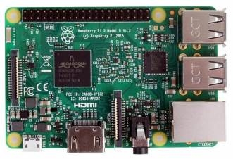

图3.5树莓派系统结构图

树莓派3B+参数如下：

CPU型号：Broadcom BCM2837 芯片组，四核Cortex-A53（ARM v8）64位SoC @ 1.5GHz

内存： 8GB 

无线网卡： 2.4 GHz和5.0 GHz IEEE 802.11ac无线，蓝牙4.2，BLE

有线网卡： 1 x 10/100 以太网端口

USB接口： 4个USB 2.0端口

GPIO引脚： Raspberry Pi标准40针GPIO接头连接器（与以前的板完全向后兼容）

显示器接口： 1个micro-HDMI端口（最多支持4kp60）

DSI屏幕： 2通道MIPI DSI显示端口

CSI摄像头： 2通道MIPI CSI摄像机端口

视频输出： 4针立体声音频和复合视频端口

H.265（4kp60解码），H264（1080p60解码，1080p30编码）

OpenGL ES 3.0图形

内存卡插槽： Micro-SD卡插槽，用于加载操作系统和数据存储

电源输入： 通过USB-C连接器5V DC（最小3A \*）

通过GPIO接头提供5V DC（最小3A \*）

POE供电： 启用以太网供电（PoE）（需要单独的PoE HAT）

工作温度： 0 – 50摄氏度环境

4. 飞控板

如下图7所示。

 

图3.6 TM4C123GH6PM 飞控板

采用高性能的 TM4C123GH6PM 芯片，主频为 80MHz。电池电压经电调降压后输入飞控板，一路 3.3V 稳压负责供应板子上的核心芯片，另一路负责所有的外部设备。配备 2 路舵机接口，可以由飞控直接控制舵机转动。飞控板上从单片机引出了 1 路 I2C 接口和 4 路Uart 接口，具有丰富的扩展性。设计时为了使设备工作更加稳定，选用了 4 枚大容量钽电容，以应对电流陡升的情况，确保飞行稳定。

4. 激光雷达

RPLIDAR A2 由 SLAMTEC 公司开发的新一代低成本二维[激光](_blank)雷达(LIDAR)，它具有每秒高达 8000 次的高速激光测距采样能力。并配备了 SLAMTEC 独有的光磁融合(OPTMAG)专利技术，克服了传统激光雷达的寿命限制，可长时间可靠的稳定运行。

RPLIDAR A2 可以实现在二维平面的 12米半径范围内进行 360 度全方位的激光测距扫描，并产生所在空间的平面点云地图信息。这些云地图信息可用于地图测绘、机器人定位导航、物体/环境建模等实际应用中。本项目利用该雷达在飞行场地建立云图。

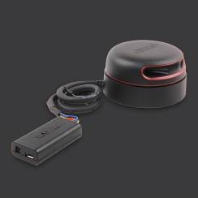

图3.7  RPLIDAR A2模块

（6）3D打印

`    `本产品使用SolidWork进行无人机的3D打印。打印的部件包括两块底板、树莓

派外挂板、三个投弹装置与八个机脚固定支架。

`    `底座板1提供与三个投弹装置的螺丝孔，提供超声底座连接的螺丝孔，同时

还提供与第二块底座板连接的减震球孔。如图9

图3.8 底座板

`    `第二块底板上有能够与第一块底座板连接的减震球孔，以及底部摄像头底座连接

的螺丝孔。如图10

图3.9 底座板2

`    `超声底座能够固定超声雷达，同时能够连接至底座板1。如图11

图3.10 超声底座

底部摄像头底座能够固定底部摄像头，同时能够连接至底座板2。如图12

图3.11 底部摄像头底座

投弹装置能够利用舵机装置来实现圆柱体的投放，固定在底座板1上。如图13

图3.12 投弹装置

树莓派外挂板提供树莓派以及树莓派扩展板的固定，侧板固定在无人机的底座

上。如图14

图3.13 树莓派外挂板

`    `机脚固定支架用于固定四个撑脚，使起飞与降落更加稳定。如图15

图3.14 机脚固定支架

`     `飞控底座上放置飞控模块，飞控底座通过减震球连接至中层板。如图16

图3.15 飞控底座

中层板提供与上层板的连接以及飞控底座的连接，最外侧提供与飞机主体的连

接。如图17

图3.16 中层板

`        `上层板提供激光雷达的支撑以及T260的支撑。如图18

图3.17 上层板

`    `飞机展示：

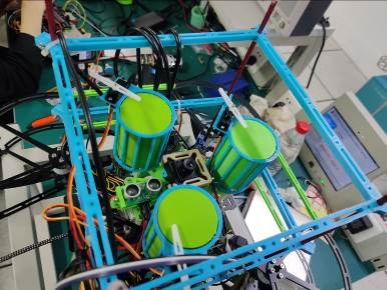

图3.18 飞机底部

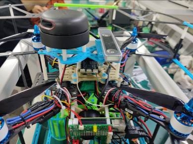

图3.19 飞机顶部

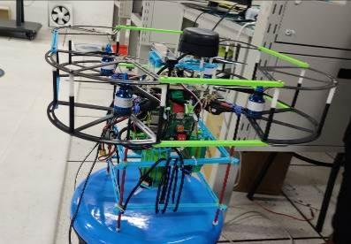

图3.20 飞机整体
## **3.2软件编程**
本飞机的基础框架基于408实验室的飞机，其基本的飞行功能早已成熟，因此在本报告中不再赘述。本章节后部分介绍的主要为本组在飞控上的改变以及为完成 本任务而新增的程序部分。

**（1）树莓派4b**

**①底部摄像头**

为了实现精准降落投货，我组在飞机的下部增加了一个对地摄像头。该摄像头和树莓派4b相连，主要用于抓取地面降落点中心的具体位置信息，再将信息通过自定义的编码方式，经由UART口传输到飞控程序中，辅助飞机落地。

具体实现过程：通过树莓派打开摄像头后，获取到其中的每帧图片信息，对得到的图片进行缩放、腐蚀以及膨胀等操作，得到一张便于处理的图片。由于地面降落区域中有大部分区域为红色，所以本组决定通过控制颜色阈值来找降落部分的中心。在得到对应颜色的RGB阈值之后，对处理过的图像进行mask处理，可以得到降落区域的范围图，再通过边缘检测，找到一个恰好框住降落区域最小的方形，该方形的中心即可粗略认为是降落区域的中心。流程图以及具体的算法流程如下图所示：

图3.21 底部摄像头算法流程

其中加入的降采样是为了减轻树莓派的计算负担，mask后的结构更易找到目标色块，根据边缘找中心点也可以稍微减轻计算量。进行以上优化后，树莓派可以实时处理视频图像。

为了改善程序对物理设备的状态控制，以面向对象的思想创建了一个Cam类。具体代码见附录。

**②激光雷达**

该任务中有避障这一环节，为解决这一问题，我组在飞机的最上方新增了一个激光雷达。该雷达也是和树莓派4b相连。在树莓派上安装好相关软件的驱动之后，就可以获得飞机四周的点图。之后确定滤除飞行区域外部的点，得到的就是飞行区域内的障碍物的点图，再根据极坐标的转换，就可以得到飞机内部坐标系下（即T265坐标系）障碍物的坐标。

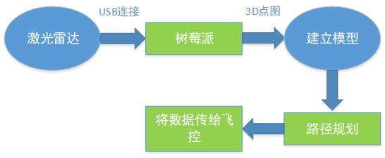

图3.22 激光雷达算法流程

路径规划：就是让检测到障碍物之后，以障碍物为圆心做圆，当飞机进入到以障碍物为圆心，一定范围内为半径的圆的边缘处时，就给予无人机一个对应圆环的切线的速度，使之能够走一个圆形避开障碍物。具体实现时，需要积累开始避障时圆形边缘的点和圆心的角度，到后面对应角度停止。示意图如下。

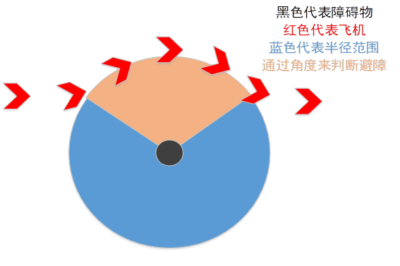

图3.23 飞机避障示意图

**③舵机控制**

当飞机成功降落到投货区域后，需要控制舵机将货物投下，为实现这一目标，我们将舵机和树莓派相连接，当树莓派接收到飞机发送过来的投货信号时，在对应的引脚上输出固定的PWM信号，控制舵机放下货物并且恢复原位。

为了方便调试，我们还在树莓派上加入了单独的蜂鸣器和LED灯（独立于飞控上的设备，方便通信方面的调试）。下为树莓派上引脚和接出来的硬件的对应图：

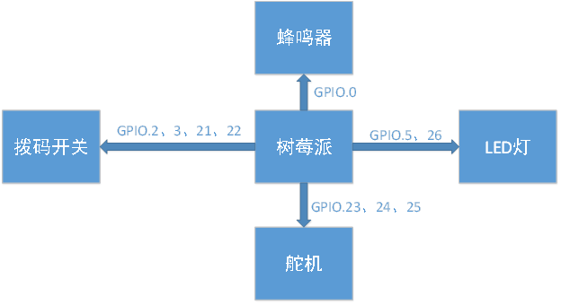

图3.24 树莓派与转接板连接引脚

由于这三个外接在树莓派上的设备都是用PWM驱动的，只是其中的脉宽以及占空比有一定打差距，下框图展示了树莓派如何在对应引脚上输出PWM信号。

图3.25 PWM波的输出

本次项目中，舵机、LED以及蜂鸣器的控制都是基于上图，但是为了用正确的PWM信号控制上述设备，中间所设计的参数有所不同。

驱动舵机需要不停地切换占空比，因此在程序设计时，我们用两个循环，设置两个渐变的占空比，实现自动打开舵机投货，并且在投货结束后自动关闭舱门。

LED灯和蜂鸣器的控制则轻松许多，只需要按照闪烁（鸣叫）的需求设置占空比即可。

1. 通信部分

原本我组想沿用之前的MAVLINK传输，但是由于其传输的性能在本飞机上并不佳，并且由于是祖传的代码，其中有一些问题难以通过代码简单解决，于是本组决定把部分通信协议改为基于UART口的hht协议。

重写的部分主要是树莓派4b和飞控之间的通信协议，我们将发送的数字压缩放入到一个数组中，通过UART口对进行二者之间的通信。该通信协议十分的简陋，仅有部分简单的对其和校验，但是经实验证明，已经可以满足我们的需求。前部分摄像头处理之后获得的图像信息、激光雷达处理后的障碍物的位置信息以及飞控给树莓派4b的投货信号都是通过这个协议进行传信的。

具体协议示意图如下：

图3.26 树莓派与飞控通信协议

1. 飞控部分的改进

为了进一步加快飞机飞行的速度，我们对飞控的部分代码进行了改写。

其一：我们对起飞进行了一定的优化，在飞机起飞之前加入了一段T265预载时间，这也可以大大减小T265在开机时出问题的可能性，再加上软件上的主动清零、校准，使得起飞时坐标系更加准确，有利于之后的定位。

其二：我们对基础的飞行代码也进行了一定的优化。之前的飞行是直接设置一个速度，用恒定速度进行飞行，最后用T265的数据进行校准，判断是否到位置。这样虽然可以完成飞行任务，但是飞行速度过慢，因此我们选择用速度控制实现直线飞行。与之前的恒定速度不同，新的控制代码用距离来控制速度，这样可以显著增加飞行速度，而且可以更好地找到重点。

其三：我们还将摄像头数据融入到飞控中，可以实现在直线上任意目标点停止（目标点有特殊标志）。

最后，我们还对降落进行了优化，为了节省时间，我们把原来的垂直下落改成倾斜下落，这样也能大幅度减少飞行时间，可以用更短的时间完成任务。
# **四、 系统测试及结果分析**
## **4.1 系统测试**
本项目的系统应用在 T408 实验室。烧录好程序后，用一个开关控制无人机开机，为实验室内师生提供极大便利，实物系统如下图。

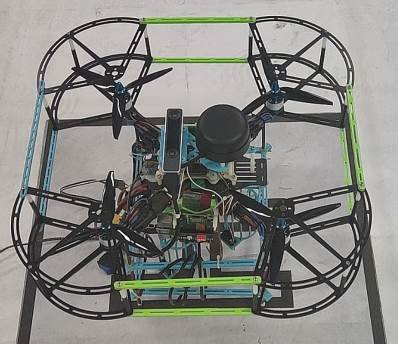

图4.1 实物系统

在安装好电池并确认各个模块连接正常之后，便可开始本次测试。基于本项目的实质内容，将其主要分为三大模块：飞行寻路，躲避障碍和货物投掷。

1. 飞行寻路功能测试

①起飞稳定阶段

在起飞之前要先经过一段时间的准备和等待蜂鸣器鸣叫后，说明树莓派已经启动完备，准备起飞。如图4.2所示。

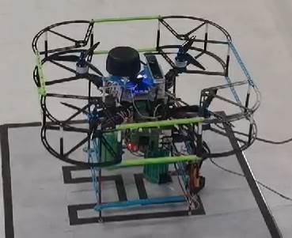

图4.2 准备起飞阶段

起飞时，通过T265传回的数据调整飞行姿态，使飞机稳定起飞。定高飞行时如下图所示。

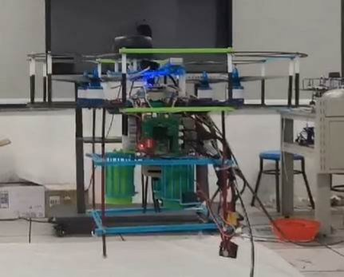

图4.3 飞行定高阶段

起飞所花费时间如下表：

表4.1 飞行时间统计

|起飞测试次数|起飞消耗时间|
| :- | - |
|第一次测试|3.32s|
|第二次测试|3.45s|
|第三次测试|3.28s|
成功起飞后，向前飞行寻找投掷位置，并降落。

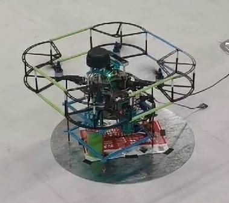

图4.4	第一个点位降落位置

在找到第一个点位并降落后，树莓派控制舵机进行投弹，完成后再次起飞，向右侧飞行寻找第二个投弹位置。重复这一步骤，寻找第三个点位。

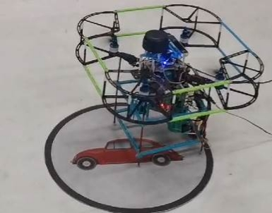

图4.5	第二个点位降落位置

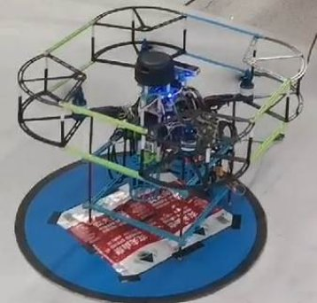

图4.6	第三个点位降落位置

寻找完全部点位后，飞回起飞位置，并降落。降落位置如图4.7 所示。

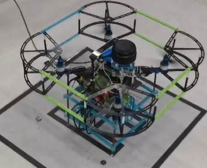

图4.7 飞回起点的降落位置

1. 躲避障碍功能测试

在飞行的路上会人为设置障碍物，树莓派通过激光雷达建立返回的数据建立模型，并躲避障碍物，绕杆飞行躲避障碍时图片如下。

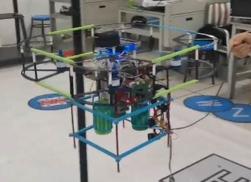

图4.8 无人机避障

（3）货物投掷功能测试

当飞机成功降落到投货区域后，需要控制舵机将货物投下，为实现这一目标，我们将舵机和树莓派相连接，当树莓派接收到飞机发送过来的投货信号时，在对应的引脚上输出固定的PWM信号，控制舵机放下货物并且恢复原位。投掷位置如下图。

图4.9 第一个货物投掷位置

图4.10 第二个货物投掷位置

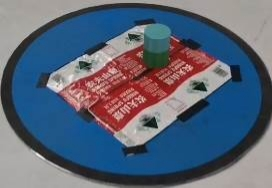

图4.11 第三个货物投掷位置

调试飞控时有用到JLINK，以及串口助手。JLINK主要用于烧录飞控程序，在必要的时候还可以用它来调试部分飞控程序。串口助手则主要用于调试串口通信。等飞机起飞之后，我们就只能通过WiFi连接观察树莓派上的数据情况。

上面提到的所有新加的模块，我们都通过正确的手段进行测试过，保证每一个模块都可以完美运行之后才上电进行飞行测试。

最终在我们不懈的调试下，飞机可以成功完成全部的飞行任务。
## **4.2 结果分析**
以表格形式给出系统测试结果。

表4-2  系统测试结果

|**系统功能**|**设计结果**|**与设计指标间的偏差与分析**|
| :-: | :-: | - |
|**飞机起飞与寻路**|能够稳定起飞并且定高飞行，起飞时间较短，定高飞行时有微量偏移，可以忽略不计|无偏差，起飞流畅稳定。|
|**树莓派与飞控通信**|未起飞时通过串口测试，数据收发正常，起飞后也能正常通信，传输树莓派处理过的信息给飞控。|无偏差，能够根据数据及时调整飞行姿态。|
|**底部摄像头图像处理**|通过树莓派打开摄像头后，获取到其中的每帧图片信息，对得到的图片进行缩放、腐蚀以及膨胀等操作，得到一张便于处理的图片。再利用色彩阈值识别投弹位置，进行投掷。|有略微偏差，投掷位置与中心点相距5cm左右。|
|**激光雷达得到3D模型并规划路线避障**|在树莓派上安装好相关软件的驱动之后，就可以获得飞机四周的点图。之后确定滤除飞行区域外部的点，得到的就是飞行区域内的障碍物的点图，再根据极坐标的转换，就可以得到飞机内部坐标系下（即T265坐标系）障碍物的坐标。|无偏差，能够识别并躲避场地上的障碍。|
|**树莓派控制舵机投掷货物**|基于树莓派输出的 PWM 波实现了舵机的控制，初始化时 90 度，步进为 2度，可进行 0～180 以内任意角度的步进调整和定位调整。|无偏差，无人机可根据自身需求调整舵机释放货物|

# **五、总结与展望**
经过一个学期的努力，我们小组完成了无人机自动投弹系统这个项目。从项目初期的懵懂学习，到中期方案调整，最后到后期的功能完善，每一步我们都付出了很多心血。项目初期，我们进行了市场调研，了解到市场上各种无人机自动投弹系统的优缺点以及考虑到本身能力后，制定好了设计方案，最后得以实现系统基本功能。本课题可以实现对周围场景的建模，寻找投放位置，躲避障碍并降落至投放区域，通过舵机自动投放，所有货物投放完成后自动返航等功能。

通过这个项目，小组成员对 3D 打印、PCB 板设计、树莓派和飞控板都有了更多的了解，每个人对于自己的分内的工作都很上心，熟练掌握相关知识。在开发过程中，我们也遇到了许多问题，但我们每周都会进行小组研讨，对上周完成了任务做一个总结并讨论存在的问题，最终想出最佳的解决方案并尝试，这种探讨与思考不仅提高了我们解决问题的能力，还使得小组的凝聚力愈加深厚。

这个系统还有很大的改进空间，比如飞行器的结构并不完美，硬件资源潜力没有全部发挥等等，之后如果有机会，我们还会在系统上进行改进，对各种性能进行优化，使它成为一个更加完善和稳定的系统。
# **参考文献**
[1]Altium Designer2019四层板智能车PCB设计视频教程 https://b23.tv/2pwwB7

[2]赵宏、包广斌、马栋林.Python 网络编程(Linux)[M].清华大学出版社:北京,2018:16.

[3]陈鹏,李子卓,李陈龙,宋昊铭,吴心雨,迟英姿.物流无人机PID控制研究[J].无线互联科技,2021,18(23):112-113.

[4]芦竹茂,武娜,赵亚宁,白洋,韩钰,高海跃.基于激光雷达的无人机在杆塔附近的定位研究[J].激光与光电子学进展,2022,59(04):28-36.

